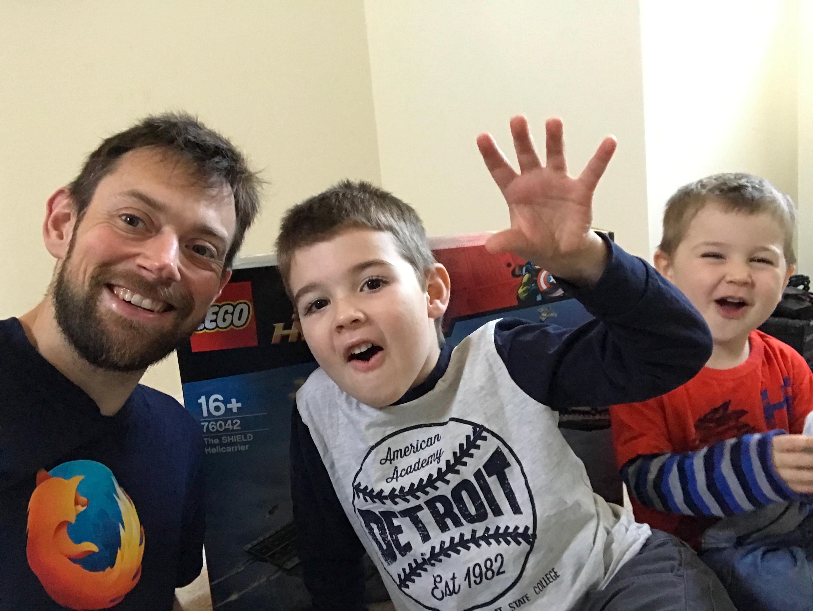
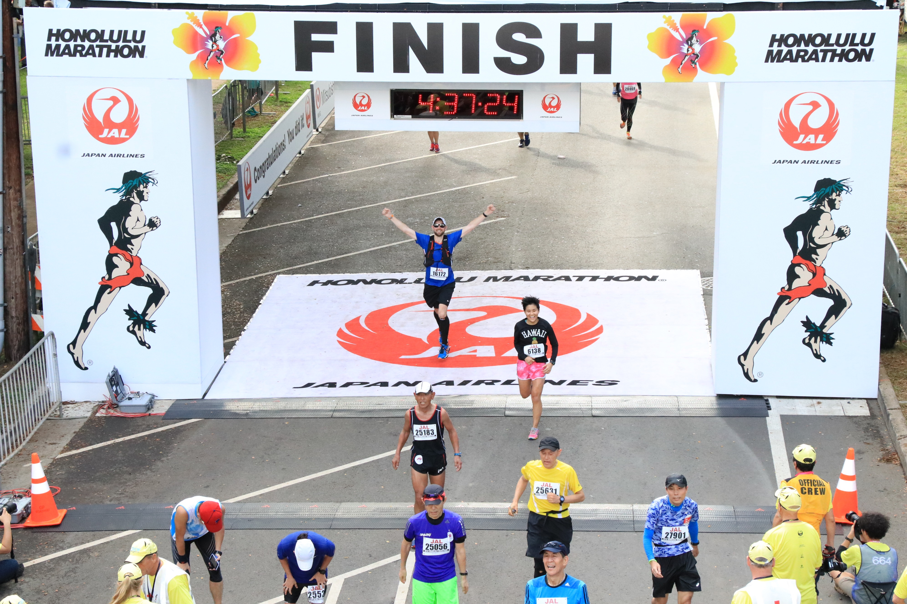
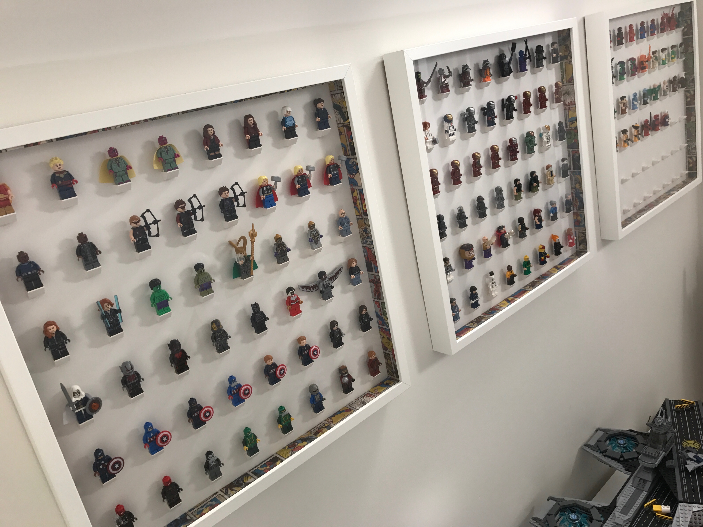

# About me
I’m Dave, and I’m an automation engineer at Mozilla. I also contribute to the Selenium open source project for browser automation. I blog at http://davehunt.co.uk, I like to run marathons, and I collect LEGO minifigures.

